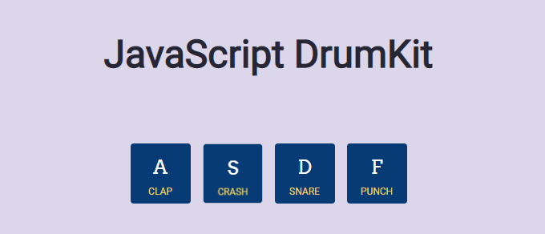

# DrumKit
Project 1/30: Javascript DrumKit with animation and sound.



## Key concepts:

### HTML:
- Audio tag: 
  ```
  <audio data-key="65" src="./sounds/clap-808.wav"></audio>
  ```
- Attribute **defer**: it tells the browser to execute the script after HTML parsing.
  ```
  <script src="script.js" defer></script>
  ```
  
### CSS:
- Resetting all properties:
  ```
  * {
      margin: 0;
      padding: 0;
      outline: 0;
      box-sizing: border-box;
  }
  ```
 - Animating:
   ```
   transition: all 0.1s;
   ```
 - Box shadow:
    ```
    box-shadow: inset 0 0 5px #000000; /*horizontal vertical blur-radius color*/
    ```
   
### JS:
- Event listener:
  ```
  document.addEventListener('keydown', doSomething);
  ```
- Reversing some animation (button going up, for instance):
  ```
  const keys = document.querySelectorAll('.key'); 
  keys.forEach(key => key.addEventListener("transitionend", removeTransition)); 
  ```
