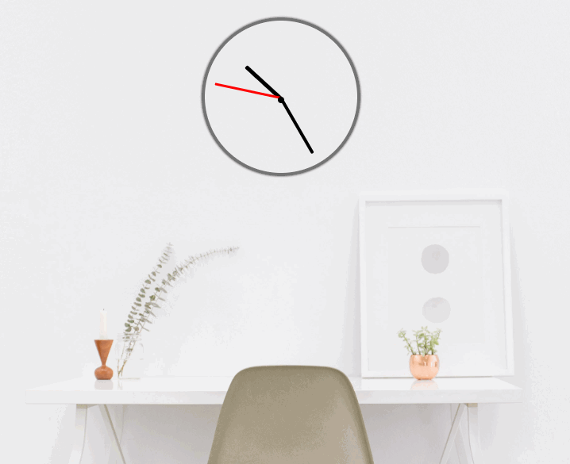

# CSS-JS-Clock

Project 2/30: CSS + Javascript clock.



## Key concepts:

### CSS:
- Superimposing HTML divs:

  *Parent*
  ```
  position: relative;
  ```
  *Child*
  ```
  position: absolute; 
  top: 50%;
  left: 50%;
  ```
  *Centralized child*
  ```
  position: relative;		
  top: 50%;
  transform: translateY(-50%);
  left: 50%;
  transform: translateX(-50%);
  ```
  
### JS:
- Date:
  ```
  const date = new Date();
  const hours = date.getHours();
  const minutes = date.getMinutes();
  const seconds = date.getSeconds();
  ```
- Periodic function:
  ```
  setInterval(setDate, 1000);
  ```
