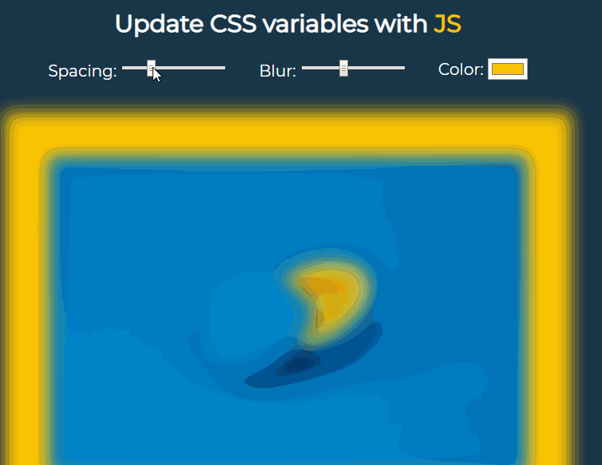

# CSS-Variables



## Key concepts:

### HTML:
- Input with label:
  ```
  <label for="spacing">Spacing:</label>
  <input type="range" name="spacing" min="10" max="200" value="10" data-sizing="px">
  ```

### CSS:
- Variables: usage var(--spacing).
  ```
  :root {
    --base-color: #FFC600;
    --spacing: 10px;
    --blur: 10px;
  }
  ```
 
### JS:
- Listen for _change_ and _mousemove_ events:
  ```
  inputs.forEach(input => input.addEventListener('change', handleUpdate));
  inputs.forEach(input => input.addEventListener('mousemove', handleUpdate));
  ```
- Function to update variables values (do not forget the suffix for certain properties):
  ```
  function handleUpdate() {
    const suffix = this.dataset.sizing || "";
    document.documentElement.style.setProperty(`--${this.name}`, this.value + suffix);
  }
  ```
